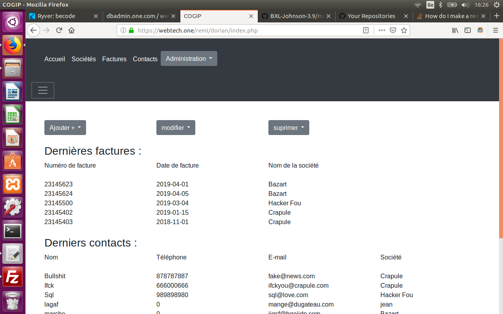

# Accounting Application COGIP

## Group project of [Dorothée Weiss](https://github.com/doropro), [Cédric Van Hove](https://github.com/cevaho), [Dorian Vanderheyden](https://github.com/dorianbec).

*Exercice made as from 8th april 2019 to 12th april 2019, working team for the [BeCode](https://www.becode.org/) Web Developper training*

## Project

For this project, we have created an accounting application for the fictive company *COGIP* using PHP, SQL and MVC architecture.

### Link to the complete instructions
https://github.com/becodeorg/BXL-Johnson-3.9/tree/master/Projets/COGIPapp

### Distribution of tasks

* Dorothée :
    - Page contact(list display, single detail page, adding new one, delete existing one and modify existing contact);
    - Invoices pages(list invoices display, single detail page, adding new one);

* Cédric :
    - Society pages(list invoices display, single detail page, adding new one, delete existing one, modify contact page);

* both have tested multiple Tables and sql queries in order to modify any information in the database, mixing pages, fixing bugs, sanitizing data, learning how phpMyAdmin works (unique key bugs,...).

* Dorian :
    - Architecture MVC (controler, vue), splitting the original php files in models and vues, loading the vue depending on the url parameters; admin daschboard, adding new user, session (?);

## Searchable site

[dorian-one.com hosting](https://remi.webtech.one/dorian/)

## samples of pages without mvc can be seen in this [repository](https://github.com/cevaho/cogip-php-sql/tree/master/without-mvc)

- [contact page](https://github.com/cevaho/cogip-php-sql/blob/master/without-mvc/contact/contact.php)
- [detail contact page](https://github.com/cevaho/cogip-php-sql/blob/master/without-mvc/contact/detailcontact.php)
- [society page](https://github.com/cevaho/cogip-php-sql/blob/master/without-mvc/societe/societe.php)
- [detail society page](https://github.com/cevaho/cogip-php-sql/blob/master/without-mvc/societe/societe-delete.php)

## Used Languages and technologies

* PHP MySql html and css
* BOOTSTRAP
* MVC structure

## Screenshot

## Objectifs d'évaluation

- Utiliser des paramètres URL et des noms de fichiers différents [*OK*]()
- Bien utiliser la sanitization pour éviter les injections SQL dans votre DB (un esprit malveillant pourrait tenter de delete l'intégralité de votre DB) [*OK*]()
- Valider les données afin que Ranu n'encode pas n'importe quoi [*Ranu peut mettre ce qu'il veut tant que ce sont des caractères normaux, il faudrait une vallidation sur les emails (b-crypt/hachage), qu'ils soient uniques aussi (annulé pour cause de bugs des clés uniques dans phpmyadmin), une meilleure validation de la tva et et du tel*]
- Contruire une base de données relationnelles fonctionnelle [*OK*]()
 - Utiliser des jointures correctes en SQL [*OK*]()
- Utiliser des alias dans vos requêtes SQL [*OK*]()
- Implémenter un CRUD :
        - réaliser une interface qui permette de lire des données [*OK*]()
        - réaliser une interface qui permette d'ajouter des données [*OK*]()
        - réaliser une interface qui permette de modifier des données [*OK*]()
        - réaliser une interface qui permette de supprimer des données [*OK*]()

## Objectifs d'apprentissage

- Crypter le mot de passe dans la base de données (il ne doit pas apparaître en clair) [*pas fait*]
- Utiliser la structure MVC pour ranger vos fichiers et vos fonctionnalités [*OK*]()
- Utiliser un routeur [*OK*]()
- Savoir mettre en place une session [*pas fait, header-loc suivi de exit pour éviter le changement de la suite du code, jamais basé sur un enregistrement du pwd, autre variable telle que l'id dans la table*]
- Permettre ou non l'accès à certaines pages en fonction des permissions de session [*à verifier quand la session sera faite*]

N'oubliez pas de mettre le fichier [SQL](https://github.com/cevaho/cogip-php-sql/tree/master/table-sql) avec la structure et les données dans votre repo. [*à faire pour le mvc*]
Les données dont Jean-Christian a besoin [*OK*]()

Absolument et non négociable : les données relatives aux personnes, sociétés et factures. [*OK*]()

### Pour les personnes, il nous faudra :

    le nom, le prénom, l'e-mail [*OK*]()

### Pour les sociétés :

    le nom de la société, le pays, le n° de TVA [*OK*]()

### Pour les factures :

    le numéro de la facture, la date de la facture [*OK*]()

### Pour le type (d'entreprises)

    le type (soit client, soit fournisseur) [*OK*]()

Eclaircissement :

    Une société de type "client" va acheter quelque chose à la COGIP, on va donc lui envoyer une facture.
    Quand la COGIP achète quelque chose à une autre société (ça peut être une nouvelle calculatrice ou de l'électricité), elle l'achète à un fournisseur qui fournit un produit ou un service.[*OK*]()

### Notes

- Concernant les relations entre les tables, il faudra :
        - societes --- type [*OK*]()
        - societes --- factures [*OK*]()
        - personnes --- factures [*OK*]()
        - personnes --- societes [*OK*]()

## L'app pour Ranu
### page d'accueil

Affichera :

- un message d'accueil pour Jean-Christian Ranu (s'il est connecté)[*pas fait  je pense*]()
- la liste des 5 dernières factures, classées par date [*OK*]()
- la liste des 5 dernières personnes encodées dans la base de données [*5 premières ordre alpha*]()
- la liste des 5 dernières entreprises encodées dans la base de données [*5 premières ordre alpha*]()
- un lien vers la page fournisseurs [*OK*]()
- un lien vers la page clients [*OK*]()

### page sociétés

Affichera la liste des sociétés par ordre alphabétique. [*OK*]()

Le nom de chaque société sera un lien qui renverra vers une nouvelle page detailsociete dont le contenu sera généré en fonction de l'id de la société choisie. [*OK*]()
page ajout societe [*OK*]()
page delete societe [*OK*]()
page modif societe [*OK*]()

### page factures

Affichera la liste des factures par date la plus récente vers la date la plus lointaine. [*OK*]()

Chaque numéro de facture sera un lien qui, au clic, renverra vers une page detailfacture dont le contenu sera généré en fonction de l'id de la facture sélectionnée. [*OK*]()
page ajout facture[*OK*]()
page delete facture[*OK*]()
page modif facture[*OK*]()

### page annuaire

Affichera la liste de toutes les personnes de contact de la base de données, par ordre alphabétique. [*OK*]()

Le nom de chaque personne sera un lien qui renverra vers une nouvelle page detailcontact dont le contenu sera généré en fonction de l'id de la personne choisie. [*OK*]()
page ajout contact [*OK*]()
page delete contact [*OK*]()
page modif contact [*OK*]()

### page fournisseurs

Affichera la liste de toutes les sociétés de type fournisseur. Chaque nom de société renvoie, à l'aide d'un lien, vers sa page detailsociete dédiée. [*à faire ?*]()

### page clients

Affichera la liste de toutes les sociétés de type client. Chaque nom de société renvoie, à l'aide d'un lien, vers sa page detailsociete dédiée. [*à faire ?*]()

### detailsociete

Affichera les informations suivantes selon la société choisie :

    nom de la société
    numéro de TVA de la société
    liste des factures liées à la société
    liste des personnes de contact travaillant dans la société
[*OK*]()

### detailfacture

Affichera les informations suivantes selon la facture choisie :

    numéro
    date
    société liée à la facture
    type de la société liée à la facture (fournisseur ou client)
    personne de contact liée à la facture
[*OK*]()

### detailcontact

Affichera les informations suivantes selon la personne de contact choisie :

    nom, prénom
    e-mail
    nom de la société où travaille la personne
    la liste des factures liées à la personne
[*OK*]()

## Partie admin de Ranu

Avant-propos :
Faites en sorte que les paramètres URL ne soient pas les mêmes que les noms de vos fichiers PHP. [*mauvais, à refaire*]()

Par exemple : imagine un site internet dont l'url pour modifier les recettes serait recettes.com/?modifplat=17
mais ferait appel au fichier nommé updaterecipe.php

De quoi Ranu a-t-il besoin ?

Une fois que vous avez réalisé la partie consultation de la base de données comptable de Jean-Christian, vous allez lui créer une interface administration pour qu'il puisse encoder, modifier et supprimer lui-même ses données depuis une chouette interface.

Il aura besoin d'un dashboard dans lequel il pourra avoir un accès direct aux :

- 5 dernières factures (n° de facture, date, société). En cliquant sur le numéro de la facture, Jean-Christian arrivera sur une page qui lui permettra de modifier la facture. Au clic du nom de la société, il pourra modifier les infos de la société.[*OK*]()
- 5 dernières sociétés (nom de la société et type de société). En cliquant sur le nom de société, Jean-Christian arrivera sur une page qui lui permettra de modifier la société.[*pas de date dans la table société, pas fait de join avec facture et société, donc juste les 5 premières sociétés par ordre alphabetique*]

- 5 derniers contacts (prénom+nom, email, nom de société). En cliquant sur le nom du contact, Jean-Christian arrivera sur une page qui lui permettra de modifier la facture. Au clic du nom de la société, il pourra modifier les infos de la société.[*pas de date dans la table contact, pas fait de join avec facture et contact, donc juste les 5 premiers contacts par ordre alphabetique*]()

- 5 derniers contacts (prénom+nom, email, nom de société). En cliquant sur le nom du contact, Jean-Christian arrivera sur une page qui lui permettra de modifier la facture. Au clic du nom de la société, il pourra modifier les infos de la société.[*pas de date dans la table contact, pas fait de join avec facture et contact, donc juste les 5 premièrs contacts par ordre alphabetique*]()

On prévoiera également que sur la même ligne de chaque élément, il y ait une petite icône représentant une poubelle afin qu'au clic de l'icône, on puisse supprimer l'élement de la ligne.

Il aura aussi des accès rapides (à l'aide de boutons) pour pouvoir ajouter :

- une nouvelle facture [*OK*]()
- un nouveau contact [*OK*]()
- une nouvelle société [*OK*]()

Et vous prévoirez un message d'accueil pour la personne connectée. Selon qu'il s'agisse de Jean-Christian ou de Muriel. [*fait ?*]()

Et vous prévoirez un message d'accueil pour la personne connectée. Selon qu'il s'agisse de Jean-Christian ou de Muriel. [*à faire*]()

GODMODE
S'il a un accès godmode, l'utilisateur connecté (par défaut Jean-Christian a un accès godmode. Son mot de passe est son nom de famille.), il aura également un bouton pour pouvoir gérer les utilisateurs. Ce bouton l'amènera vers un dashboard qui lui permettra de voir les utilisateurs connectés, leurs accès et de pouvoir les modifier.

[*on en est où ?*]()

MODE MODO
Le mode modérateur (ou mode modo) sera attribué à Muriel, la collaboratrice de Jean-Christian. Elle a accès au dashboard admin, elle peut ajouter des factures, sociétés et personnes mais elle ne peut ni modifier, ni supprimer des éléments de la base de données. Son mot de passe est également son nom de famille.

[*on en est où ?*]()
